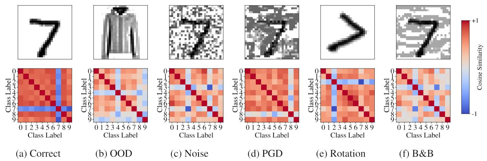
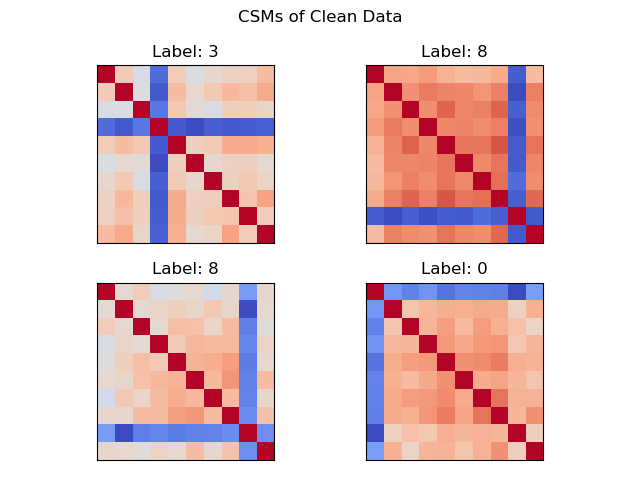
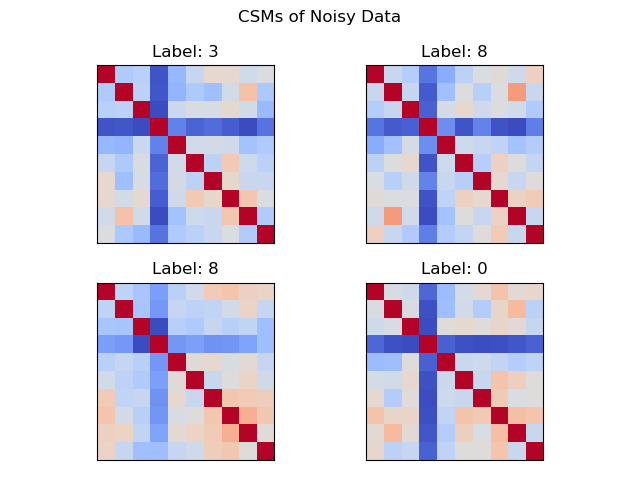

# GGA-Identifying-Untrustworthy-Predictions
Code relative to "Identifying Untrustworthy Predictions in Neural Networks by Geometric Gradient Analysis"
*Leo Schwinn, An Nguyen, René Raab, Leon Bungert, Daniel Tenbrinck, Dario Zanca, Martin Burger, Bjoern Eskofier*
Paper: https://arxiv.org/abs/2102.12196
Accepted at UAI 2021

We propose a geometric gradient analysis (GGA) of the input gradients of neural networks to detect out-of-distribution data and adversarial attacks. GGA does not require retraining of a given model. Here, we analyze and interpret the gradient of a neural network w.r.t. its input (e.g., saliency map). More precisely, for a given input sample we inspect the geometric relation among all possible saliency maps, calculated for each output class of the model. This is achieved by a pairwise calculation of the cosine similarity between saliency maps. The cosine similarites for a given input can be summarizes with cosine similiarty maps (CSMs).

The following image exemplifies how GGA can be used to differentiate different data types for a MNIST model by calculating the respective CSM for every input:



Examples of CSMs for the "Standard" CIFAR10 model provided by RobustBench libary (https://github.com/RobustBench/robustbench) are given below:

<p float="center">
  
  
</p>

## How to use GGA

GGA can be installed with the following command:

### Instalation and Requirements
```
pip install gga-csm
```

GGA only requires torch.
The example in this repository requires torch and the robustbench libary (https://github.com/RobustBench/robustbench).

###

To compute the cosine similarity map for a given input use the following code:

``` python
from gga.CSM import cosine_similarity_maps

csm = cosine_similarity_maps(model, x)
```

An example is also given in tests/main.py

## Citation

If you use our method in a publication please cite:
```
@article{schwinn2021identifying,
  author    = {Leo Schwinn and
               An Nguyen and
               Ren{\'{e}} Raab and
               Leon Bungert and
               Daniel Tenbrinck and
               Dario Zanca and
               Martin Burger and
               Bjoern Eskofier},
  title     = {Identifying Untrustworthy Predictions in Neural Networks by Geometric
               Gradient Analysis},
  journal   = {CoRR},
  volume    = {abs/2102.12196},
  year      = {2021},
}
```
